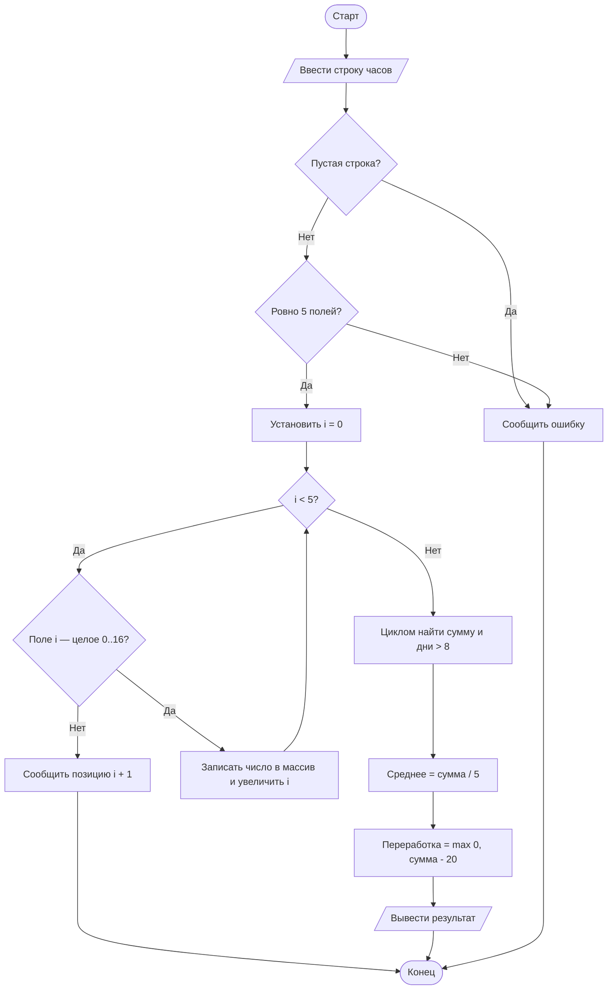

# Практическая работа №5 — Activity

```mermaid
flowchart TD
    A([Старт]) --> B[/Ввести строку часов/]
    B --> C{Пустая строка?}
    C -- Да --> E[Сообщить ошибку]
    C -- Нет --> D{Ровно 5 полей?}
    D -- Нет --> E
    D -- Да --> F[Установить i = 0]
    F --> G{"i < 5?"}
    G -- Да --> H{Поле i — целое 0..16?}
    H -- Нет --> I[Сообщить позицию i + 1]
    I --> Z([Конец])
    H -- Да --> J[Записать число в массив и увеличить i]
    J --> G
    G -- Нет --> K["Циклом найти сумму и дни > 8"]
    K --> L[Среднее = сумма / 5]
    L --> M[Переработка = max 0, сумма - 20]
    M --> N[/Вывести результат/]
    N --> Z
    E --> Z
```

Цикл разбора массива — `Main.parseHours`, вычисления — отдельные методы `Main.calculateTotal`, `calculateAverage` и `countOvertimeDays`.

