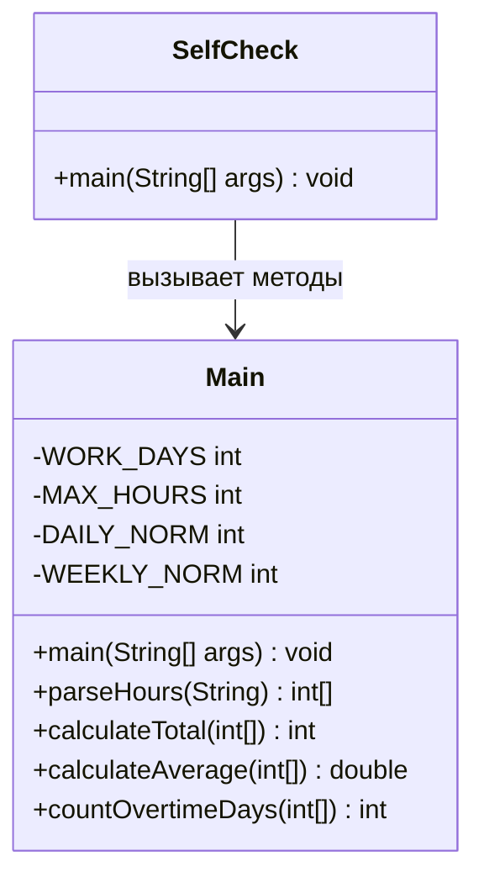

# Практическая №5 — диаграмма классов

```mermaid
classDiagram
    class Main {
      -WORK_DAYS int
      -MAX_HOURS int
      -DAILY_NORM int
      -WEEKLY_NORM int
      +main(String[] args) void
      +parseHours(String) int[]
      +calculateTotal(int[]) int
      +calculateAverage(int[]) double
      +countOvertimeDays(int[]) int
    }
    class SelfCheck {
      +main(String[] args) void
    }
    SelfCheck --> Main : вызывает методы
```

