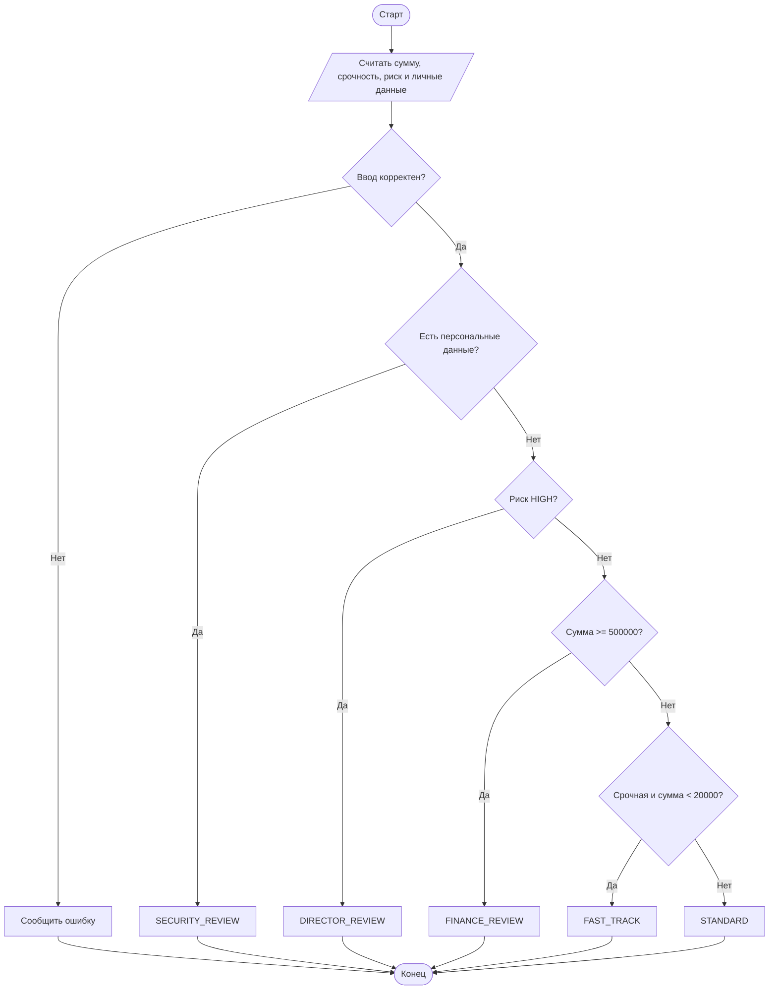

# Практическая работа №6 — Activity

```mermaid
flowchart TD
    A([Старт]) --> B[/Считать сумму, срочность, риск и личные данные/]
    B --> C{Ввод корректен?}
    C -- Нет --> E[Сообщить ошибку]
    C -- Да --> D{Есть персональные данные?}
    D -- Да --> S[SECURITY_REVIEW]
    D -- Нет --> F{Риск HIGH?}
    F -- Да --> G[DIRECTOR_REVIEW]
    F -- Нет --> H{"Сумма >= 500000?"}
    H -- Да --> I[FINANCE_REVIEW]
    H -- Нет --> J{"Срочная и сумма < 20000?"}
    J -- Да --> K[FAST_TRACK]
    J -- Нет --> L[STANDARD]
    E --> Z([Конец])
    S --> Z
    G --> Z
    I --> Z
    K --> Z
    L --> Z
```

Порядок ромбов соответствует порядку `if` в `ApprovalService.route`.

