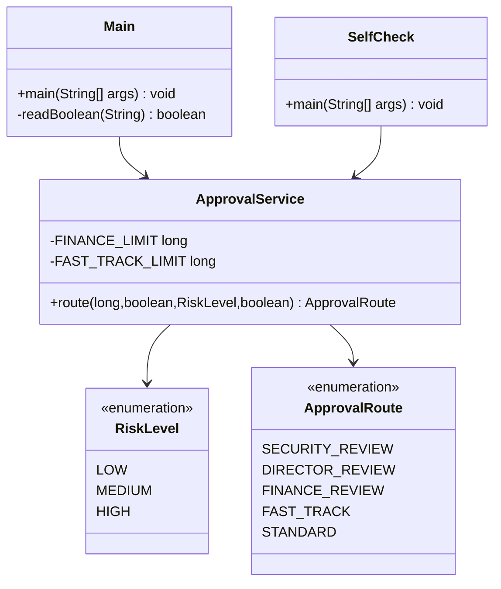

# Практическая №6 — диаграмма классов

```mermaid
classDiagram
    class Main {
      +main(String[] args) void
      -readBoolean(String) boolean
    }
    class RiskLevel {
      <<enumeration>>
      LOW
      MEDIUM
      HIGH
    }
    class ApprovalRoute {
      <<enumeration>>
      SECURITY_REVIEW
      DIRECTOR_REVIEW
      FINANCE_REVIEW
      FAST_TRACK
      STANDARD
    }
    class ApprovalService {
      -FINANCE_LIMIT long
      -FAST_TRACK_LIMIT long
      +route(long,boolean,RiskLevel,boolean) ApprovalRoute
    }
    class SelfCheck {
      +main(String[] args) void
    }
    Main --> ApprovalService
    ApprovalService --> RiskLevel
    ApprovalService --> ApprovalRoute
    SelfCheck --> ApprovalService
```

