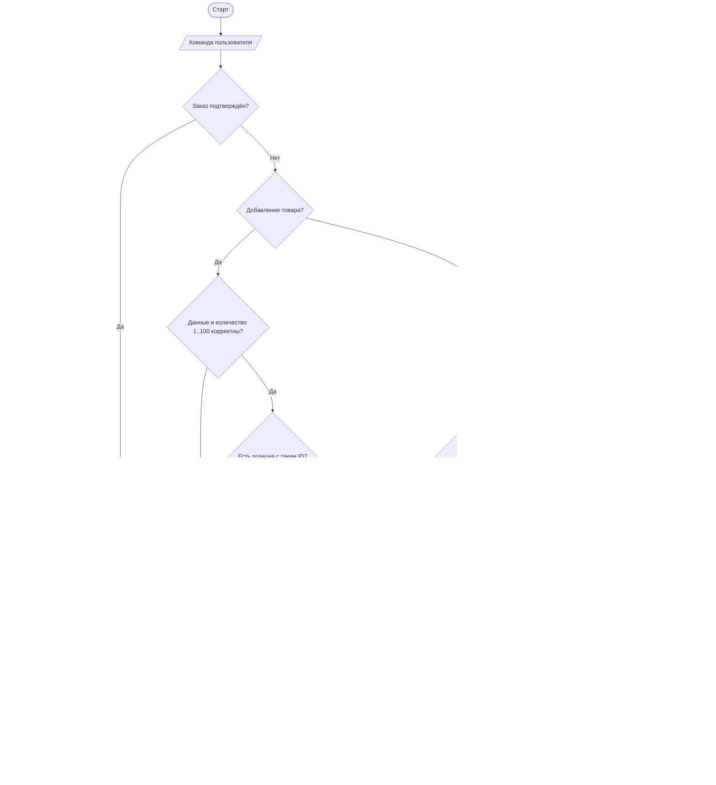

# Практическая работа №7 — Activity

```mermaid
flowchart TD
    A([Старт]) --> B[/Команда пользователя/]
    B --> C{Заказ подтверждён?}
    C -- Да --> D{Изменяющая команда?}
    D -- Да --> E[Ошибка изменения]
    D -- Нет --> M[Показать заказ и итог]
    C -- Нет --> F{Добавление товара?}
    F -- Да --> G{Данные и количество 1..100 корректны?}
    G -- Нет --> E
    G -- Да --> H{Есть позиция с таким ID?}
    H -- Да --> I{"Совпадает товар и сумма количеств <= 20?"}
    I -- Да --> J[Заменить позицией с общей суммой]
    I -- Нет --> E
    H -- Нет --> K[Добавить новую позицию]
    F -- Нет --> L{Удаление или подтверждение?}
    L -- Удаление --> N[Удалить позицию по ID]
    L -- Подтверждение --> O{Заказ не пуст?}
    O -- Да --> P[Установить confirmed = true]
    O -- Нет --> E
    L -- Просмотр --> M
    J --> Q[Пересчитать total по позициям]
    K --> Q
    N --> Q
    P --> Q
    Q --> Z([Конец операции])
    M --> Z
    E --> Z
```

Ветка добавления повторного товара соответствует `EquipmentOrder.addProduct`; проверка после `confirm` — `ensureEditable`.

