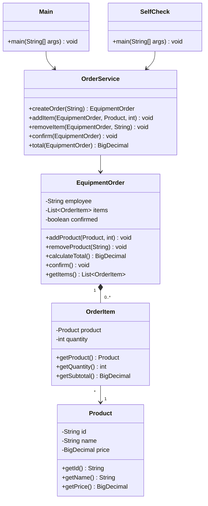

# Практическая работа №7 — диаграмма классов

```mermaid
classDiagram
    class Main {
      +main(String[] args) void
    }
    class Product {
      -String id
      -String name
      -BigDecimal price
      +getId() String
      +getName() String
      +getPrice() BigDecimal
    }
    class OrderItem {
      -Product product
      -int quantity
      +getProduct() Product
      +getQuantity() int
      +getSubtotal() BigDecimal
    }
    class EquipmentOrder {
      -String employee
      -List~OrderItem~ items
      -boolean confirmed
      +addProduct(Product, int) void
      +removeProduct(String) void
      +calculateTotal() BigDecimal
      +confirm() void
      +getItems() List~OrderItem~
    }
    class OrderService {
      +createOrder(String) EquipmentOrder
      +addItem(EquipmentOrder, Product, int) void
      +removeItem(EquipmentOrder, String) void
      +confirm(EquipmentOrder) void
      +total(EquipmentOrder) BigDecimal
    }
    class SelfCheck {
      +main(String[] args) void
    }
    EquipmentOrder "1" *-- "0..*" OrderItem
    OrderItem "*" --> "1" Product
    Main --> OrderService
    OrderService --> EquipmentOrder
    SelfCheck --> OrderService
```

