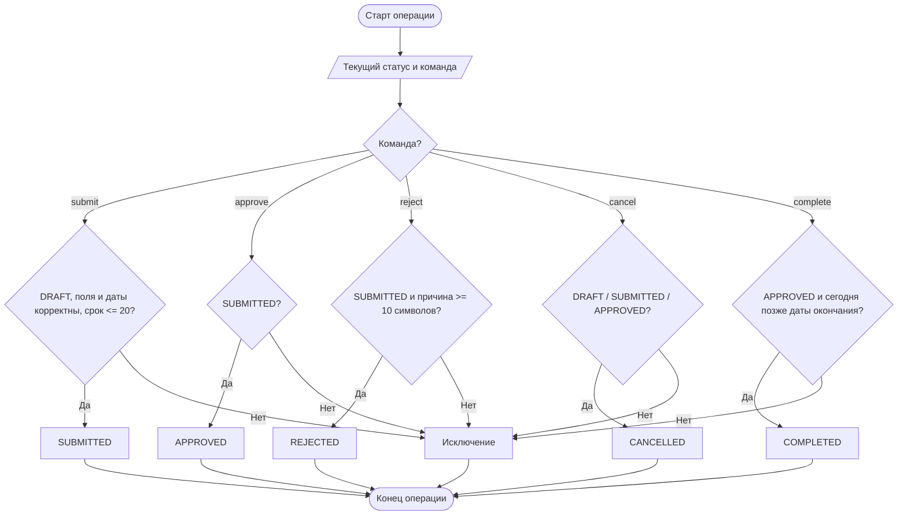

# Практическая работа №8 — Activity

```mermaid
flowchart TD
    A([Старт операции]) --> B[/Текущий статус и команда/]
    B --> C{Команда?}
    C -- submit --> D{"DRAFT, поля и даты корректны, срок <= 20?"}
    D -- Да --> E[SUBMITTED]
    C -- approve --> F{SUBMITTED?}
    F -- Да --> G[APPROVED]
    C -- reject --> H{"SUBMITTED и причина >= 10 символов?"}
    H -- Да --> I[REJECTED]
    C -- cancel --> J{DRAFT / SUBMITTED / APPROVED?}
    J -- Да --> K[CANCELLED]
    C -- complete --> L{APPROVED и сегодня позже даты окончания?}
    L -- Да --> M[COMPLETED]
    D -- Нет --> X[Исключение]
    F -- Нет --> X
    H -- Нет --> X
    J -- Нет --> X
    L -- Нет --> X
    E --> Z([Конец операции])
    G --> Z
    I --> Z
    K --> Z
    M --> Z
    X --> Z
```

Каждая ветвь соответствует одноимённому доменному методу `BusinessTrip`.

