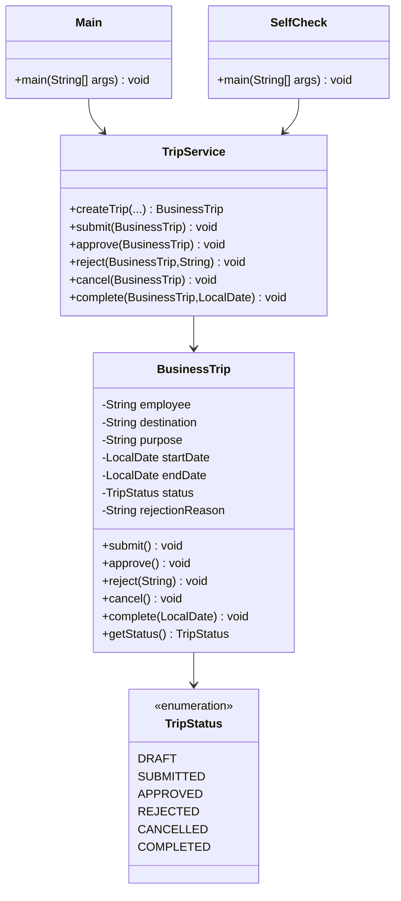

# Практическая работа №8 — диаграмма классов

```mermaid
classDiagram
    class Main {
      +main(String[] args) void
    }
    class TripStatus {
      <<enumeration>>
      DRAFT
      SUBMITTED
      APPROVED
      REJECTED
      CANCELLED
      COMPLETED
    }
    class BusinessTrip {
      -String employee
      -String destination
      -String purpose
      -LocalDate startDate
      -LocalDate endDate
      -TripStatus status
      -String rejectionReason
      +submit() void
      +approve() void
      +reject(String) void
      +cancel() void
      +complete(LocalDate) void
      +getStatus() TripStatus
    }
    class TripService {
      +createTrip(...) BusinessTrip
      +submit(BusinessTrip) void
      +approve(BusinessTrip) void
      +reject(BusinessTrip,String) void
      +cancel(BusinessTrip) void
      +complete(BusinessTrip,LocalDate) void
    }
    class SelfCheck {
      +main(String[] args) void
    }
    BusinessTrip --> TripStatus
    TripService --> BusinessTrip
    Main --> TripService
    SelfCheck --> TripService
```

